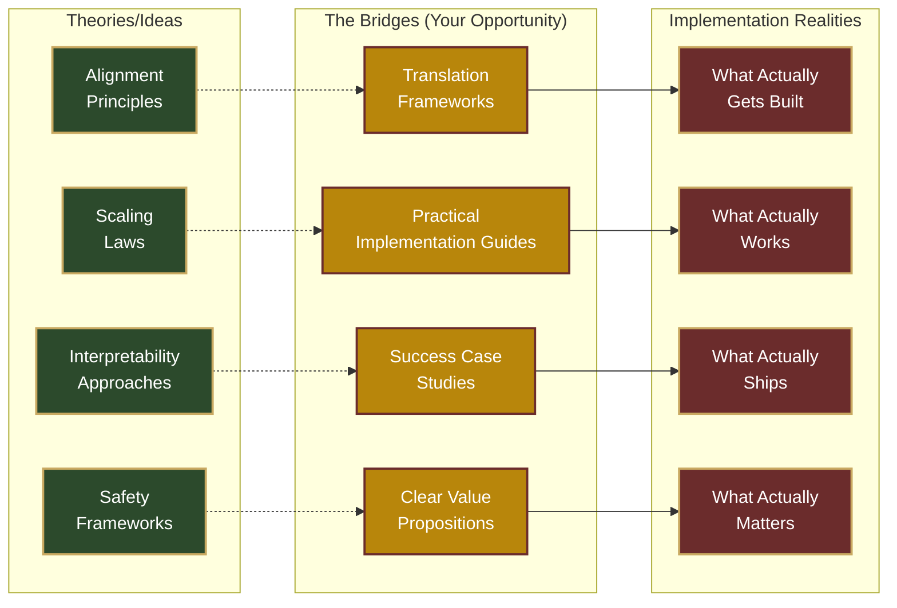
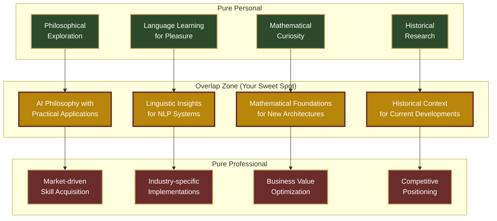

# The Borderlands Atlas - Radial AI Navigation Mindmap

## Central Question: How do I build durable value in a field of constant disruption?

```mermaid
graph TD
    A["🎯 Central Question:<br/>How do I build durable value<br/>in a field of constant disruption?"] --> B["🟢 What I Know<br/>(Established Territories)"]
    A --> C["🔵 What I'm Learning<br/>(Active Expeditions)"]
    A --> D["🟡 What I Offer<br/>(The Fog Zone)"]
    A --> E["🔴 What Field Needs<br/>(Gap Analysis)"]
    
    B --> B1["NLP/Linguistics<br/>Foundations"]
    B --> B2["AI Philosophy<br/>Basics"]
    B --> B3["Mathematical<br/>Foundations"]
    B --> B4["Language<br/>Acquisition"]
    
    C --> C1["Alignment<br/>Research"]
    C --> C2["Scheming/Deception<br/>Research"]
    C --> C3["RL<br/>Fundamentals"]
    C --> C4["PeFT & Efficient<br/>Training"]
    
    D --> D1["Theory-to-Practice<br/>Translation"]
    D --> D2["Cross-Domain<br/>Synthesis"]
    D --> D3["Historical Context<br/>for New Developments"]
    D --> D4["Onboarding Pathways<br/>for Newcomers"]
    
    E --> E1["Theory-Implementation<br/>Bridges"]
    E --> E2["Durable Learning<br/>Pathways"]
    E --> E3["Rapid Adaptation<br/>Frameworks"]
    E --> E4["Value Proposition<br/>Clarity"]
    
    classDef centerNode fill:#6B2C2C,stroke:#C9A961,stroke-width:3px,color:#fff
    classDef knownNode fill:#2C4A2C,stroke:#C9A961,stroke-width:2px,color:#fff
    classDef learningNode fill:#1A1F3A,stroke:#C9A961,stroke-width:2px,color:#fff
    classDef offerNode fill:#B8860B,stroke:#6B2C2C,stroke-width:2px,color:#fff
    classDef needsNode fill:#6B2C2C,stroke:#C9A961,stroke-width:2px,color:#fff
    
    class A centerNode
    class B,B1,B2,B3,B4 knownNode
    class C,C1,C2,C3,C4 learningNode
    class D,D1,D2,D3,D4 offerNode
    class E,E1,E2,E3,E4 needsNode
```

## Theory-Practice Gap Analysis

## Personal-Professional Integration Spectrum

## Key Questions for Exploration
- What makes my cross-domain synthesis unique?
- How can I measure the value of theory-practice translation?
- What are the most critical gaps in current AI education?
- How do I build a sustainable learning system that adapts to rapid change?
- What would a "durable value proposition" look like in this field?
- How can I create content that helps others navigate these same challenges?

## Next Actions
- [ ] Clarify "What I Offer" through specific projects
- [ ] Map dependencies more precisely
- [ ] Identify 3-5 key contribution opportunities
- [ ] Create content that demonstrates unique value
- [ ] Build network of theory-practice translators
- [ ] Develop frameworks for rapid adaptation
